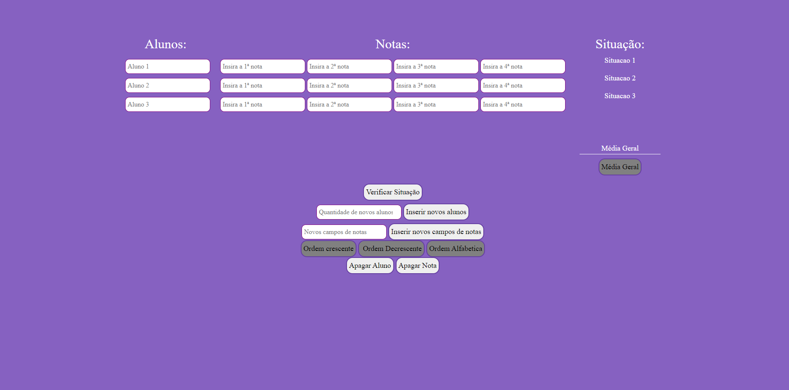

<h1 align="center"> Sistema De Notas Senai 2DT </h1>

<h2> Objetivo Do Site:</h2>  
    
 Site Com a finalidade de calcular as médias de alunos de uma instituição De Ensino 

    
 <ul>
  <h1> Tecnologias usadas:</h1>
    <h3> Javascript 5</h3>
    <h3> Html:5</h3>
    <h3> Css:3</h3>
  <h3> Booststrap </h3>
 </ul>
 <ul> 
  <h1> Integrantes Do Grupo:</h1>
  <li> Christian Lima Santana</li>
  <li> Gabriel Felix  Da Silva</li>
  <li> Kaike Carmona Rodrigues </li>
  <li> Leonardo Dias Dos Santos </li>
  <li> João Vitor De Lima Gonçalves</li>
  
